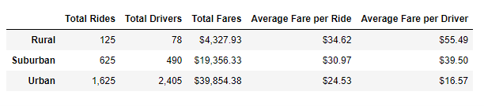
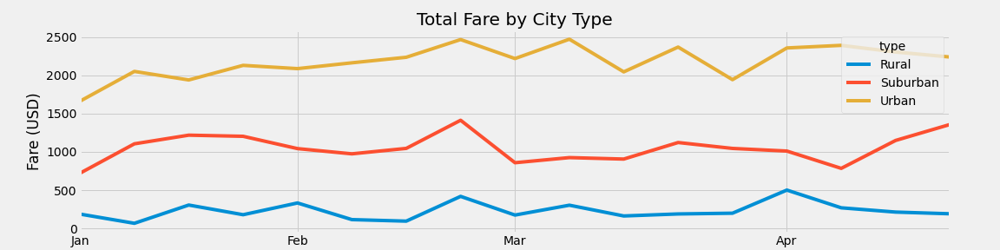

# PyBer_Analysis UofT Bootcamp Challenge Module 6

## Overview
### Purpose
The analysis uses the data given for rides and city type (urban, suburban, and rural). Metrics such as average fare per ride and average fare per driver will be determined for each city type and compared. An analysis of total fare from January to April of 2019 by city type was also conducted. Recommendations will be made from the comparison of these metrics.

## Results

From the data provided, metrics were calculated and categorized by city type in the figure shown below. Urban cities had the most rides, drivers and fares. Rural cities had the highest average Fare per Ride and average fare per Driver. Suburban cities are in the middle and average fare per ride and average fare per driver are close.

Metrics by City Type

The chart below compares the total fare by city of type over the months of January to April of 2019. This shows any variations of fare over time for the different city types.

Total Fare by City Type (January to April 2019)

## Summary

After preparing the the table and graph above, recommendations can be made for the ride share business. The average fare per driver is less than the average fare per ride for urban cities which means some drivers do not generate fares. More marketing could grow the number of rides or the company could decrease the number of drivers to minimize costs and preserve reputation as a good company to be a driver. Likewise more marketing could grow the number of drivers in rural cities and provide a better service to customers as the average fare per driver is higher that average fare per ride. From the graph over the four months, the demand for rides in the different city types can be inferred. The graph should be sent to marketing to guide when they should do more to increase the number of rides for each city type.
